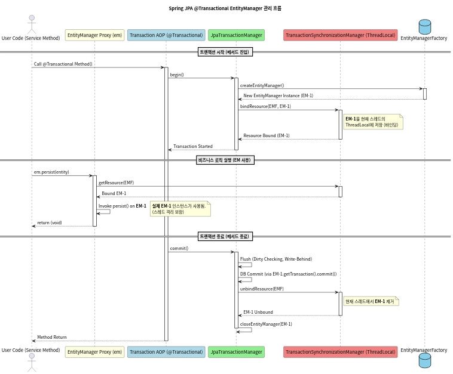

## EntityManager 는 여러 스레드에서 공유하나요?

***

> JPA에서 EntityManager 은 Thread-safe 하지 않기에 여러 스레드에서 공유하면 안됩니다. 하지만 Spring 환경에서 공유하는 것처럼 보이는 것은 주입된 객체가 실제 객체가 아닌 프록시 객체이기 때문에 필요 시 현재 스레드에 할당된 실제 EntityManager 로 요청을 위임합니다. 따라서 이와 관련된 동시성 문제를 프레임워크에 위임하여 싱글톤 방식으로 개발할 수 있습니다.

***

JPA 는 기본적으로 **한 요청 당**, 하나의 **EntityManager** 를 사용한다.

또한 각 EntityManager 는 정해진 영속성 컨텍스트를 참조한다.

> 일반적으로는 EntityManager 한 개당 하나의 영속성 컨텍스트를 가지지만, 스프링에서 공통된 영속성 컨텍스트 하나를 여러 EntityManager 가 참조한다.
> 

그렇다면 위에서 Spring의 공통 영속성 컨텍스트를 공유한다. 처럼 들리는데 

### EntityManager 는 여러 Thread 에서 공유하나?

---

> JPA 의 `EntityManager` 는 Thread-safe 하지 않는다.
> 

💡 그렇기에 스레드 간 공유가 제한된다.

- `Entity ManagerFactory`
    
    DB 커넥션 풀을 생성하고, JPA 메타데이터를 관리하는 무거운 객체이기에 
    
    애플리케이션 전체에서 한 번만 생성되고 스레드 세이프해서 공유가 가능하다.
    
- `EntityManager`
    
    내부적으로 DB 커넥션을 유지하고 영속성 컨텍스트를 관리하는 객체입니다.
    
    특정 스레드가 자원을 수정하는 동안 다른 스레드가 개입 시 데이터 정합성의 문제가 있기에 스레드 간 공유는 해서는 안됩니다.
    

### SingleTon 과 EntityManager 🤔

---

우리는 기본적으로 Bean 으로 등록된 객체는 싱글톤으로 스프링에서 관리한다는 사실을 압니다.

`EntityManager` 또한 Bean 으로 등록된 객체일텐데 왜 공유가 안 되는 것 일까요?

바로 `EntityManager` 는 사용 시마다 새로운 인스턴스가 생성되는 Prototype 스코트를 가지기 때문일까요? 🤔

- 프로토타입 스코프란
    
    thread-unsafe 한 설계를 가지는 빈은 프로토 타입으로 설정합니다.
    
    그러나 프로토 타입 스코프 빈으로 사용하는 것 자체가 애플리케이션에 불필요한 부하를 줄 수 있습니다.
    

### 아닙니다. ❌

---

`EntityManager` 타입의 필드에 IoC 컨테이너가 싱글톤 스코프를 가지는 **프록시 객체**를 주입 후 사용자가 필요에 따라 실제 인스턴스를 생성하고 해제해 사용자 입장에서 프로토 타입의 스코프 빈처럼 사용할 수 있습니다.

1️⃣ App 이 실행되면 프록시 객체를 싱글톤 빈에 넣습니다.

2️⃣ 멀티 스레드 환경에서 특정 스레드가 `@Transactional` 이 적용된 메서드를 호출해 트랜잭션이 시작됩니다.

3️⃣ 전에 말했던 `TransactionInterceptor` 이 동작하며 데이터베이스 커넥션 획득, ThreadLocal 에 해당 트랜잭션을 위한 `EntityManager` 를 생성해 바인딩합니다.

4️⃣ 프록시 EntityManger 가 호출이 된다면 내부적으로 ThreadLocal 을 조회해서 현재 요청을 보낸 스레드에 매핑된 실제 EntityManger 을 찾아서 위임합니다.

5️⃣ 트랜잭션이 커밋 | 롤백 시 생성되었던 EntityManager 을 닫고 ThreadLocal 에서 제거합니다. 그렇기에 스레드 간 자원이 차단될 수 있습니다.

### 참고자료

---

쓰레드 관련 자료
[Spring에서 멀티 쓰레드 비동기 프로그래밍 해보기](https://320hwany.tistory.com/107)